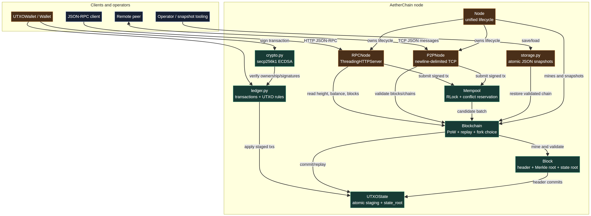
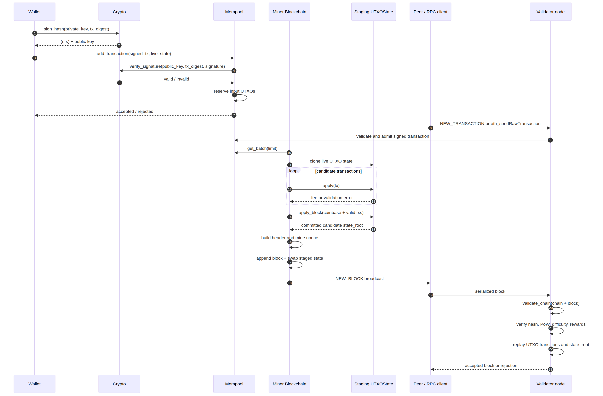

# AetherChain Architecture

## 1. System goal

AetherChain is a compact, auditable single-node implementation of a UTXO blockchain. Its runtime is intentionally standard-library-only and separates concerns into cryptography, transaction/state validation, chain control, transport, RPC, and snapshots.

The selected protocol is:

> **secp256k1 ECDSA → signed UTXO transactions → PoW blocks → committed UTXO state roots → cumulative-work fork choice**

The code does not combine the earlier account/PBFT branch with the UTXO/PoW branch.

## 2. Component map



The source-level component map is also available as [architecture.mmd](architecture.mmd).

### Responsibilities

| Component | Responsibility | Trust boundary |
|---|---|---|
| `crypto.py` | Curve arithmetic, key generation, signing, verification, addresses | Private key stays local; public keys/signatures are untrusted inputs |
| `ledger.py` | Transaction model, UTXO ownership, conservation, state roots | Every transaction and UTXO payload is validated |
| `blockchain.py` | Mempool, mining, reward accounting, replay validation, fork choice | Candidate blocks/chains are fully replayed before adoption |
| `p2p.py` | Newline-delimited TCP transport and serialization | Network data is untrusted and admission-gated |
| `rpc.py` | JSON-RPC HTTP read/write surface | RPC parameters are untrusted; private keys are never accepted |
| `storage.py` | Versioned atomic JSON snapshots | Snapshots are validated before becoming live state |
| `node.py` | Unified lifecycle for chain, RPC, P2P, mining, and snapshots | Startup rollback and explicit shutdown |

## 3. Data model

### Transaction

A transaction payload is canonical JSON containing:

```text
sender
inputs: [{tx_id, output_index}, ...]
outputs: [{recipient, amount}, ...]
```

The transaction ID is the SHA-256 digest of that payload. Signatures and public keys authenticate the payload but are not part of the transaction ID. This keeps the ID stable across wire serialization while retaining deterministic signing.

A normal transaction must:

1. Have at least one input and one positive integer output.
2. Have a public key whose derived address equals `sender`.
3. Have a valid low-`s` ECDSA signature.
4. Reference existing UTXOs owned by the sender.
5. Not repeat an input.
6. Have `sum(outputs) <= sum(inputs)`.

The difference is the miner fee.

### UTXO state

`UTXOState.utxo_pool` maps `tx_id:output_index` to immutable `UTXO` records. Applying a transaction deletes spent inputs and creates new outputs. `clone()` creates a staging copy, allowing block validation to commit all-or-nothing.

The state root is:

```text
SHA256(join_sorted("utxo_id|recipient|amount", "\n"))
```

An empty UTXO set is therefore deterministic and still has a 64-character root.

### Block

The block header commits:

```text
index
previous_hash
merkle_root
state_root
difficulty
timestamp
nonce
```

The block hash is SHA-256 over canonical sorted JSON of that header. Mining increments `nonce` until the hex digest begins with `difficulty` zeroes.

## 4. Block production flow



1. A wallet selects UTXOs, creates payment/change outputs, and signs the canonical transaction hash.
2. The mempool validates the transaction against current state and rejects duplicate input reservations.
3. Mining uses a selection clone to replay candidate transactions and calculate fees.
4. A coinbase transaction pays `block_reward + fees` to the miner.
5. A fresh staging clone applies coinbase plus valid transactions.
6. The staged `state_root` is inserted into the candidate header.
7. PoW runs over the complete header.
8. The chain and live state are swapped into place only after successful staging.

## 5. Validation and fork choice

`Blockchain.validate_chain` replays every candidate block from an empty state and checks:

- Sequential block indexes
- Genesis and previous-hash links
- Header hash integrity
- Historical expected difficulty
- Proof-of-work prefix
- Exactly one first-position coinbase
- UTXO transaction validity and atomic state transitions
- Coinbase subsidy plus included-fee limit
- State-root equality after every block

`replace_chain` adopts a candidate only when it is valid and has **strictly greater cumulative work**, using `16 ** difficulty` per block as the educational work estimate. A longer chain with lower work is rejected.

## 6. Difficulty adjustment

At an epoch boundary (`next_index % adjustment_interval == 0`), elapsed time across the prior epoch is compared with:

```text
target_block_time × adjustment_interval
```

The ratio is clamped to `[0.25, 4.0]`, then applied to the previous integer difficulty and rounded. Non-boundary blocks inherit their parent’s difficulty. Validation recomputes this rule from the candidate history; it does not trust the node’s current difficulty.

## 7. Network architecture

P2P uses newline-delimited JSON over TCP:

```text
HANDSHAKE
GET_CHAIN / CHAIN_RESPONSE
NEW_TRANSACTION
NEW_BLOCK
```

Incoming transactions enter the local mempool only after validation. Incoming blocks are validated against `chain + [block]`. Chain responses are deserialized, replayed, and passed to cumulative-work fork choice.

Current limitations:

- No peer identity or authentication
- No encryption
- No request IDs, pagination, or backpressure
- No peer scoring or ban list
- No block announcement inventory protocol
- Local development transport, not an internet-ready network

Frames are capped at 1 MiB, message types are allowlisted, serialized block hashes are checked, and non-object payloads are rejected before dispatch. `Node` provides the recommended process boundary: it starts P2P first, starts RPC second, rolls back P2P if RPC startup fails, and stops both services explicitly.

## 8. RPC architecture

`RPCNode` wraps `ThreadingHTTPServer` and dispatches JSON-RPC 2.0 requests. Reads expose height, balance, state root, chain statistics, live UTXOs, transaction lookup, mempool, and serialized blocks. Writes accept an already-signed serialized transaction and pass it through the same mempool validation path as P2P traffic. A lightweight `GET /health` endpoint supports process probes.

RPC never receives or generates private keys.

## 9. Persistence

`save_chain` writes a versioned snapshot containing configuration and serialized blocks. It writes to a sibling temporary file, flushes and `fsync`s it, then atomically replaces the destination. `load_chain` reconstructs the configured node and refuses to return until the full chain has replay-validated.

The snapshot is a recovery/export format, not an append-only database or crash-consistent multi-process journal.

## 10. Concurrency model

- `Blockchain._lock` protects chain/state replacement, mining, and validation-sensitive operations.
- `Mempool._lock` protects pending transaction insertion, batch selection, and removal.
- RPC uses a threaded HTTP server; each request enters the same locked blockchain/mempool paths.
- P2P uses one daemon accept loop plus one daemon reader thread per socket.

Mining currently holds the blockchain lock through selection, staging, and PoW. That is simple and safe for the demo node but serializes mining and RPC state changes. A production implementation should snapshot a candidate template, release the lock during PoW, and revalidate the parent before commit.

## 11. Threat model and production boundary

The implementation defends against malformed signatures, invalid curve points, invalid ownership, duplicate inputs, double spends, overpayment, bad links, invalid roots, and invalid PoW. It does **not** provide production-grade security against:

- Key theft or side-channel attacks
- Sybil peers or eclipse attacks
- Hash-power attacks
- Denial of service
- Network-level censorship
- Persistent-storage corruption beyond atomic replacement
- Reorganizations requiring finality guarantees

Before real value, replace educational cryptography and leading-zero PoW with audited libraries/protocols, authenticated encrypted transport, durable storage, formal consensus/finality, and an independent security review.
